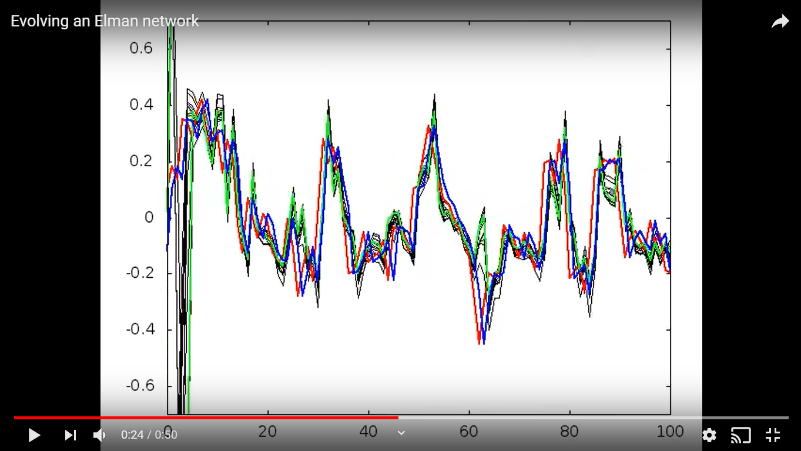

# Several implementations of Kuperin's Elman RNN for Forex forecasting.

> This repository contains source files of several implementations of [Yuri Kuperin](https://artesliberales.spbu.ru/en/faculty/personalii/kuperin)'s [Elman RNN](https://en.wikipedia.org/wiki/Recurrent_neural_network#Elman_networks_and_Jordan_networks) used for [forecasting Forex trends](https://arxiv.org/abs/cond-mat/0304469). 

In [their paper](https://arxiv.org/abs/cond-mat/0304469), Kuperin et al describe a way to make predictions of Forex exchange rates by using a particular Recurrent Neural Network structure.

These files contain my interpretation of such experiments. I've used a genetic algorithm to evolve the best neural network, to perform the same statistical tests from Kuperin's experiments on it.

I've made a [YouTube video](https://www.youtube.com/watch?v=Yz1NYskvFg0) of the way the neural network was evolved:

The red plot represents the input value for the RNN. The blue plot represents the desired output. The black plots represent suboptimal RNNs from each generation (each generation is represented by a frame on the video). The green plot represents the best (most evolved) RNN from each generation.

After months of experimenting with this RNN I came to the realization that the method was mostly useless for accurate Forex prediction.

In my [other repo](https://github.com/voscarmv/kuperin_forex_srn) I made an experiment to refute the effectiveness of Kuperin's RNN for forecasting Forex. I've written [this article](https://docs.google.com/document/d/1PE2vJcHmYtQNk5GS110QhNYIVHj6k80hiZdO12mv11w/pub) detailing how I came to this refutation.

## Installation

These source files are provided as-is for instructional purposes only. The project requires the basic build-essential packages, as well as gnuplot to function.

## Usage example

Contact me for instrucitons on how to use this code.

## Contact info

**Oscar Mier**
- Github: [@voscarmv](https://github.com/voscarmv)
- Twitter: [@voscarmv](https://twitter.com/voscarmv)
- Linkedin: [Oscar Mier](https://www.linkedin.com/in/oscar-mier-072984196/) 

## Future features and improvements

- Perform an experiment where I fit the output of the RNN to it's input, and start evolving it from there. An input equal to the output should be closer to the desired RNN weight set so it should be easier to evolve a RNN from that starting point.

## 🤝 Contributing

Contributions, issues and feature requests are welcome!

Feel free to check the [issues page](../../issues/).

## Show your support

Give a ⭐️ if you like this project!
